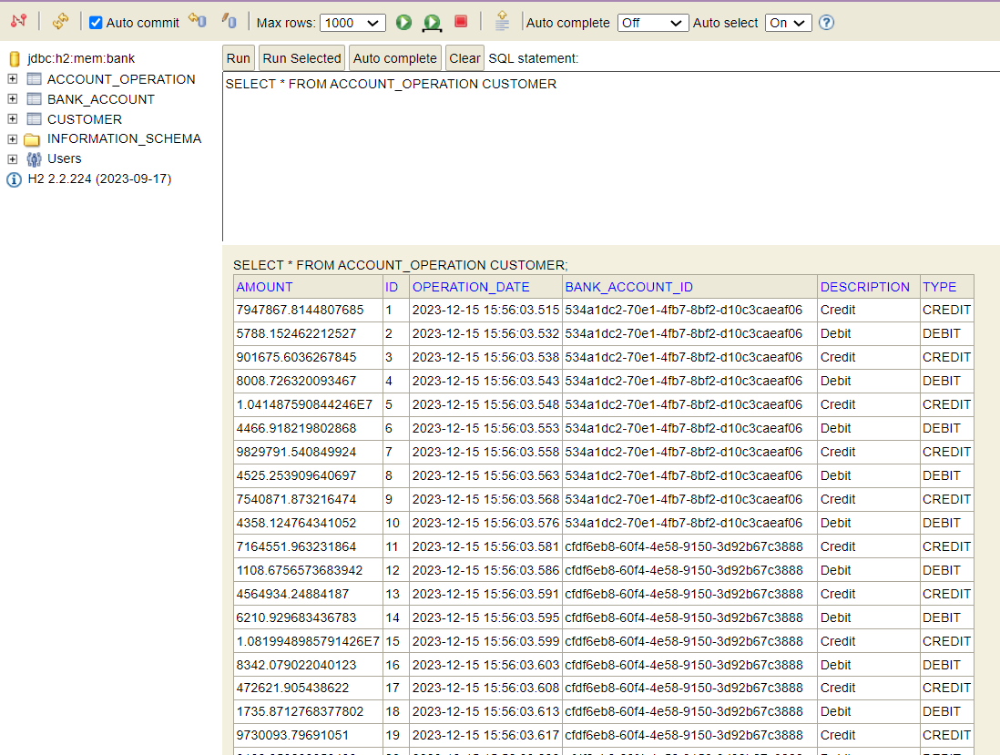
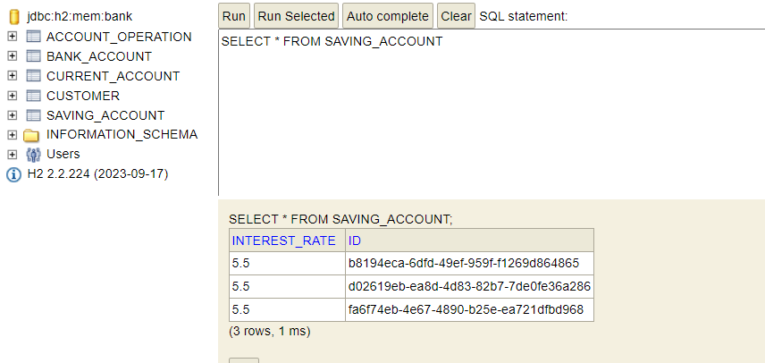
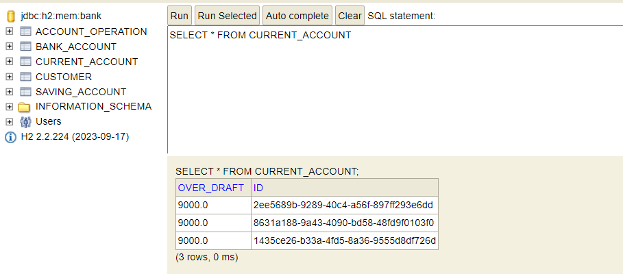
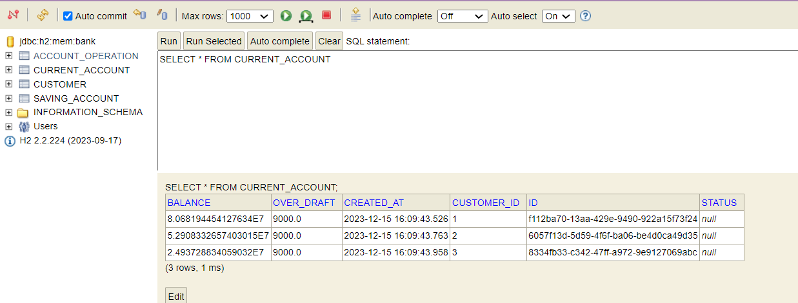
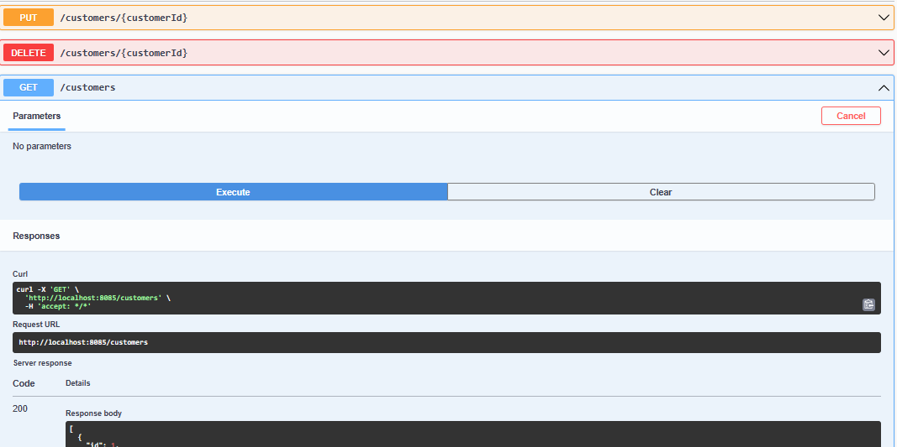
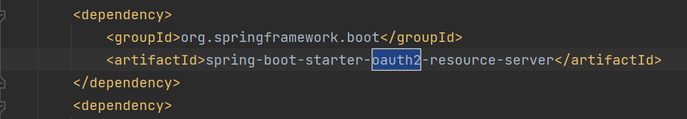
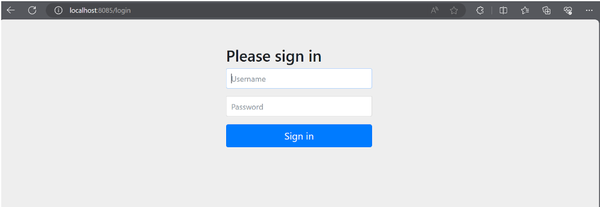

Réalisé par : DANOUNI Nouhaila ------------------------------------------------------------------------------</p>
<h1>TP N°6 : Spring Angular Spring Security JWT </h1>
<h2>Introduction</h2>
<p>
Dans le cadre de ce travail, notre objectif est de concevoir et développer une application de gestion de comptes bancaires, offrant une solution complète et robuste pour la manipulation et le suivi des transactions financières. Ce projet s'articule autour de plusieurs étapes clés, chacune visant à construire une application fonctionnelle et sécurisée.


Le processus de développement est découpé en trois grandes parties, chacune abordant une facette spécifique du projet. La première partie se concentre sur la création de la couche DAO (Data Access Object), responsable de l'accès aux données. À cette fin, nous utiliserons le framework Spring Boot, un choix réputé pour sa simplicité et son efficacité dans le développement d'applications Java.

<h2>Architecture:</h2>


<h2>Partie 1 : Couche DAO</h2>
<h3>Création du Projet Spring Boot:</h3>
<p>La première étape de notre projet consiste à mettre en place l'environnement de développement en créant un projet Spring Boot. Spring Boot offre une infrastructure simplifiée pour le développement d'applications Java, permettant une configuration rapide et une gestion aisée des dépendances.</p>
<h3>Créer les entités JPA : Customer, BankAccount, Saving Account, CurrentAccount, AccountOperation:</h3>
<p>Après avoir établi le projet Spring Boot, la création des entités JPA (Java Persistence API) est cruciale. Ces entités, telles que Customer, BankAccount, Saving Account, CurrentAccount et AccountOperation, définissent la structure des données manipulées par l'application. Chaque entité représente une table dans la base de données, et les relations entre elles reflètent la logique métier du système bancaire.</p>

<h3>Créer les interfaces JPA Repository basées sur Spring Data:</h3>
<p>Les interfaces JPA Repository, basées sur Spring Data, sont essentielles pour faciliter l'accès aux données. En définissant ces interfaces, nous utilisons la puissance de Spring Data pour générer automatiquement les requêtes SQL nécessaires aux opérations CRUD (Create, Read, Update, Delete). Cela simplifie considérablement la couche DAO en évitant la rédaction manuelle de requêtes SQL.</p>

<h3>Mapping Héritage:</h3>


**H2 DATABASE**<br>

<ul>
<li><h4>Stratégie "Single Table":</h4></li>

<p>la valeur du type Saving Account</p>

<p>la valeur du type Current Account</p>


<p>table Bank Account</p>

<p>table Customer</p>

<p>table Account Operation</p>

<li><h4>Stratégie "Joined":</h4></li>
<p> Les autres tables restent les mêmes, sauf bankAccount, CurrentAccount, SavingAccount qui seront modifiées.</p>
<p>générer joined table</p>

<p>table Saving Account</p>

<p>table Current Account</p>

<p>table Bank Account</p>

<p>table Account Operation</p>

<p>table Customer</p>


<li><h4>Stratégie "Table Per Class":</h4></li>
<p> Les autres tables restent les mêmes, sauf bankAccount qui ne sera pas présente, et à la place, nous aurons deux tables : CurrentAccount et SavingAccount.</p>
<p>générer per table Bank Account </p>


<p>table Current Account</p>

<p>table Saving Account</p>

<p>table Account Operation</p>

<p>table Customer</p>


</ul>
<h3>Consulter un customer:</h3>


<h3>Basculement vers MySQL en utilisant la stratégie "Single Table":</h3>

<h3>Affichage des customers:</h3>


## Couche DAO
Dans cette section, nous avons créé un projet Spring Boot et
mis en place la couche d'accès aux données (DAO). Les entités JPA telles que Customer,
BankAccount, Saving Account, CurrentAccount, et AccountOperation ont été définies. 
Les interfaces JPA Repository basées sur Spring Data ont été mises en place pour interagir 
avec la base de données.Des tests ont été effectués pour valider le bon fonctionnement de la couche DAO.

**SQL**


<li>Interfaces JPA Repository :</li>


# Test de la Couche DAO

<li>Couche Service et DTOs :</li>

1. afficher la liste des clients<br>


2. Afficher les Comptes<br>


3. Chercher Un compte<br>


4. Afficher les Opération d'un compte<br>


## Tests et Documentation
# Swagger
Swagger a été intégré pour la documentation automatique des API REST. Cet outil génère une documentation interactive basée sur les annotations dans le code source. Grâce à Swagger, les développeurs peuvent explorer et comprendre facilement les endpoints disponibles, les paramètres requis, et les réponses attendues, tout en facilitant l'intégration avec d'autres parties du système. stp redonne moi ca en fonction de mon projet et comment j'ai pu les exploiter dans mon projet et utilise on
1. Consulter les End-points

    1.1 .Clients
   
    1.2  .Banque et Sécurité
   
2. Tester les End-points<br>
        2.1  .Clients
 
   2.2  .Comptes

3. Schéma de notre projet
   
4. Un document json qui décrit les fonctionnalitées de notre API Restful
   

# Postman
Postman a été utilisé comme un outil essentiel pour tester les API exposées par l'application. Il offre une interface conviviale pour envoyer des requêtes HTTP aux endpoints spécifiés, permettant ainsi aux développeurs de tester les fonctionnalités de manière interactive. Les collections Postman peuvent être créées pour regrouper les requêtes associées à différentes fonctionnalités.
  **OpenAPI definition**
l'importation d'un fichier OpenAPI dans Postman offre une intégration fluide entre la documentation de l'API et les tests pratiques, améliorant ainsi l'efficacité du développement et de la validation de l'API.

les étapes:
=> Ouvrez Postman 
=> Ouvrez Postman
=> Choisissez "OpenAPI"
=> Importez le fichier OpenAPI
## Sécurisation de l'Application avec un Système d'Authentification basé sur Spring Security et JSON Web Token
La sécurisation de l'application bancaire a été réalisée en mettant en place un système d'authentification basé sur Spring Security et l'utilisation de JSON Web Token (JWT). Cette approche renforce la sécurité de l'application en assurant un accès sécurisé aux fonctionnalités tout en prévenant les accès non autorisés.
1. Dépendance: ```spring-boot-starter-oauth2-resource-server```

La dépendance spring-boot-starter-oauth2-resource-server dans
un projet Spring Boot sert à configurer l'application en tant que
serveur de ressources OAuth 2.0. Elle permet à l'application de valider
les jetons d'accès OAuth 2.0, vérifier les autorisations et sécuriser les 
ressources sensibles. Cela est utile dans les architectures où l'authentification 
et l'autorisation sont gérées par un serveur d'authentification externe, et l'application
agit en tant que serveur de ressources sécurisé.
2. Login
   
3. Authentification Basic avec Utilisation d'outils Http Client
   
   
   À chaque fois que l'authentification de base (Basic) est utilisée, lors de l'envoi d'une requête, il est nécessaire d'inclure les informations d'identification (nom d'utilisateur et mot de passe) dans l'en-tête d'autorisation. Ces informations doivent être encodées en Base64.
        
**Consultation des Clients**
   
         **Consultation du profil**
  

4. JWT

Avec l'approche HTTP Basic, il est nécessaire d'envoyer à chaque fois le nom d'utilisateur et le mot de passe. Pour simplifier cela, nous allons passer à l'utilisation de JSON Web Tokens (JWT).

Dans cette approche, un token est généré lors de l'authentification et deux beans sont utilisés :
<ul>
<li>
Le bean encoder, qui signe et génère les tokens JWT.
</li><li>
Le bean decoder, un filtre qui intercepte les requêtes, récupère le JWT, vérifie la signature, et extrait les informations du token.
</li></ul>
==>Cela permet de simplifier le processus d'authentification en utilisant des tokens signés pour transporter les informations d'identification de manière sécurisée.
  
4.1 Génération du JWT

Avec JWT, au lieu d'envoyer le nom d'utilisateur et le mot de passe à chaque requête, on envoie le token généré sous la forme d'un "Bearer".

L'utilisation du terme "Bearer" dans ce contexte signifie que le porteur (bearer) du token est authentifié. Lorsqu'on envoie une requête avec un token JWT, on inclut généralement l'en-tête Authorization avec la valeur "Bearer" suivie du token. Cela permet au serveur de comprendre que le token est utilisé pour l'authentification.


4.2 Consulter le profil

La requête GET vers l'URL ```http://localhost:8085/auth/profile``` renvoie une réponse réussie avec un code HTTP 200 et un contenu au format JSON. La réponse fournit des détails complets sur le profil de l'utilisateur authentifié, comprenant ses autorités, des informations détaillées sur la requête, le statut d'authentification, les informations du principal (utilisateur), les informations d'identification associées au token JWT, le token lui-même, le nom de l'utilisateur, et les attributs du token tels que la date d'expiration et la portée. Ces informations offrent une vue détaillée du statut et des caractéristiques de l'utilisateur authentifié, fournissant une base solide pour la gestion de l'authentification dans l'application.


4.3 Consulter les clients


4.4 Ajouter un client autorisé (en tant qu'administrateur)


4.5 Ajouter un client non autorisé (en tant qu'utilisateur)


## Conclusion 
En conclusion, le projet JEE Backend, construit sur les technologies Spring, Angular, Spring Security, et JWT, a été développé dans le but de fournir une solution complète pour la gestion bancaire. La première partie de l'architecture de l'application a été détaillée, mettant en avant la mise en place de la couche DAO avec des entités JPA telles que Customer, BankAccount, Saving Account, CurrentAccount, et AccountOperation.

Les tests et la documentation ont mis en avant l'intégration réussie de Swagger pour la documentation interactive des API REST. Les tests effectués avec Postman, ainsi que l'utilisation de l'OpenAPI definition, démontrent une approche solide pour la validation des fonctionnalités de l'application.

La sécurisation de l'application, une composante cruciale, a été implémentée avec succès en intégrant Spring Security et en adoptant JSON Web Token (JWT). Les dépendances nécessaires, le processus d'authentification avec JWT, et les différentes étapes telles que la génération du JWT ont été expliqués en détail.

En plus de la partie backend, la modélisation des entités, la mise en place des repositories, l'utilisation d'énumérations et de DTOs, la gestion des exceptions, les mappers, les services, et la partie web avec les contrôleurs ont été élaborés pour garantir une application bien structurée et facile à maintenir.

Ce projet offre une solution holistique pour la gestion bancaire en mettant l'accent sur la sécurité, la documentation, et la qualité du code. L'intégration réussie de différentes technologies témoigne d'une approche moderne et efficace pour le développement d'applications robustes et sécurisées.


